# Subscription Revenue Data Platform

## 📌 Overview

This project simulates a SaaS subscription platform and builds an end-to-end data pipeline to process subscription events into analytics-ready datasets.

It demonstrates modern data engineering practices including streaming ingestion, CDC-based modeling, medallion architecture, and cross-platform analytics using AWS, Databricks, and Snowflake.

## 🟨 Architecture

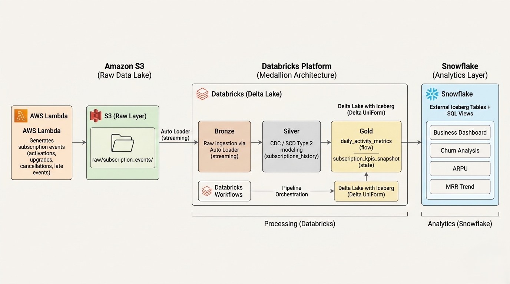

### Data Flow

AWS Lambda → S3 → Databricks (Bronze → Silver → Gold) → Iceberg Tables → Snowflake → Analytics Views

## 🟦 Pipeline Orchestration (Databricks Workflows)

The pipeline is orchestrated using Databricks Workflows to keep things structured across Bronze, Silver, and Gold layers.

Each run follows a simple flow:
- Bronze ingestion (Auto Loader)
- Silver transformations (cleaning + state modeling)
- Gold aggregations and snapshots

This setup makes it easy to run the pipeline consistently without manually triggering each step.

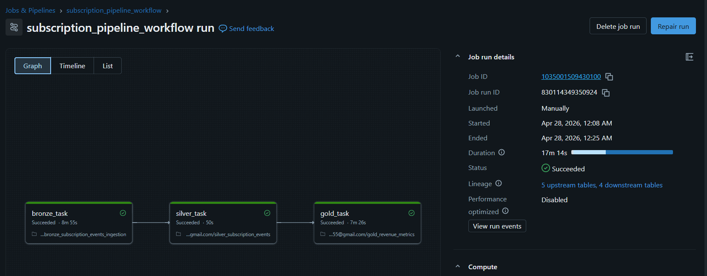

## 🟧 Tech Stack

- **AWS**: Lambda, S3, IAM
- **Databricks**: Auto Loader, Structured Streaming, Delta Lake, Unity Catalog
- **Storage Format**: Delta Lake with Iceberg (Delta UniForm)
- **Warehouse**: Snowflake (Analytics Layer)
- **Languages**: Python (PySpark), SQL

## 🟫 Data Ingestion (AWS)

Raw subscription events are generated using AWS Lambda and stored in S3.

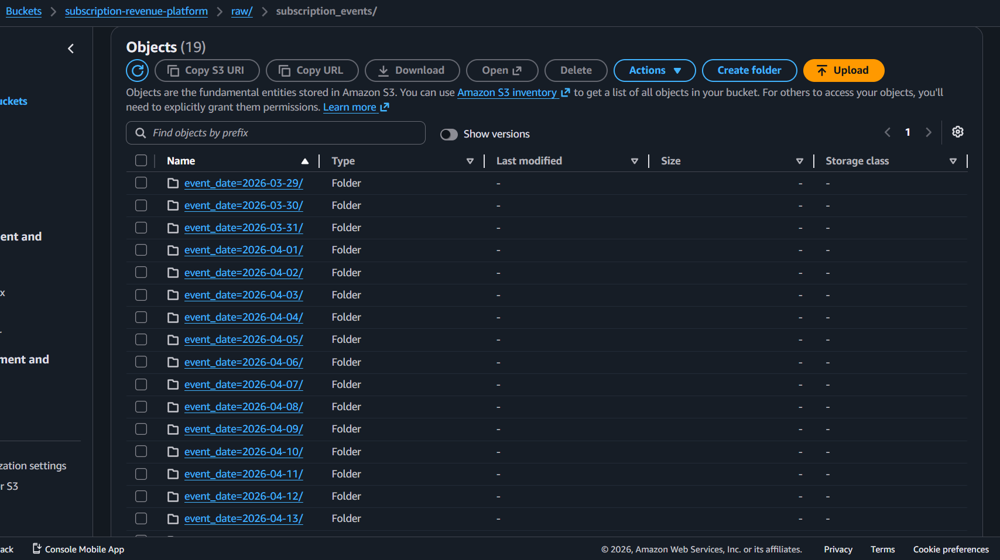

These events simulate real-world SaaS billing systems with:

- subscription activations
- upgrades/downgrades
- cancellations
- late-arriving events
- duplicate events

## 🧪 Data Simulation Strategy

To make the data feel realistic, events are generated in a controlled way instead of just random inserts.

- A configurable `BASE_DATE` is used in Lambda
- Each run generates:
  - events for that day
  - late events from the previous 1–3 days

This helps simulate real-world issues like delayed ingestion and out-of-order events.

I also added snapshot backfill logic in the Gold layer so I could generate historical data and build meaningful time-series metrics.

## 🥉 Bronze Layer (Raw Ingestion)

Raw JSON events are ingested into Databricks using Auto Loader.

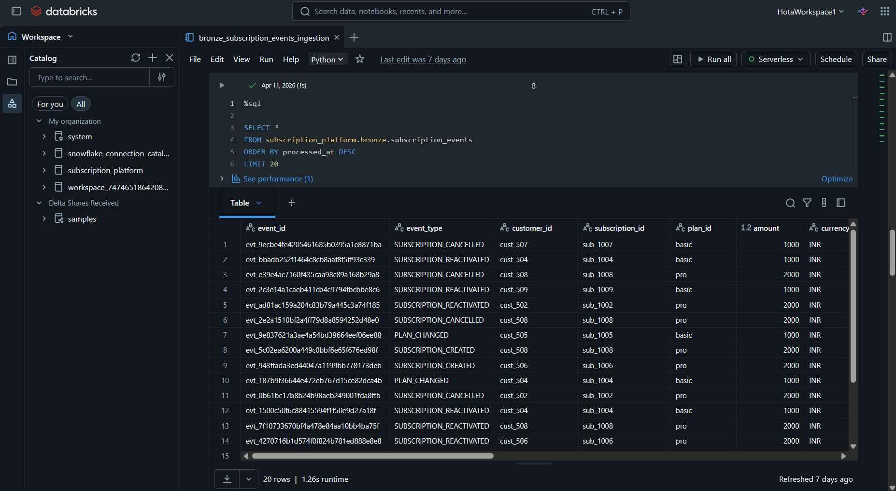

### Key Features

- Streaming ingestion
- Schema enforcement
- Metadata tracking (`processed_at`, `source_file`)

## 🥈 Silver Layer (State Modeling)

The Silver layer reconstructs subscription lifecycle using CDC logic.

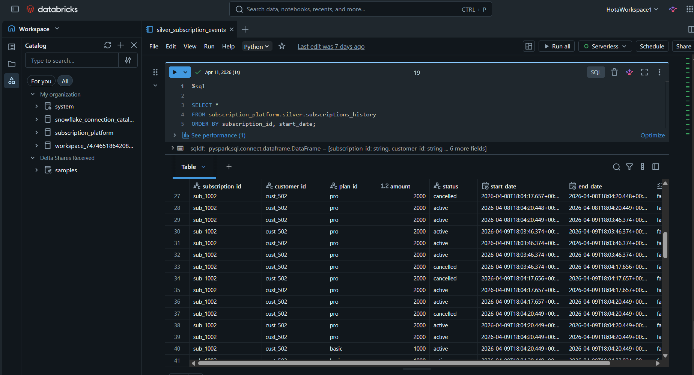

### Key Features

- Deduplication using `event_id`
- Event ordering using `event_time`
- Subscription state modeling (SCD Type 2 style)
- Handles late-arriving and out-of-order events

## 🥇 Gold Layer (Business Metrics)

The Gold layer transforms subscription state data into business-facing metrics, separating activity (events) from state (snapshots) to enable accurate analytics.

### ▸ Daily Activity Metrics

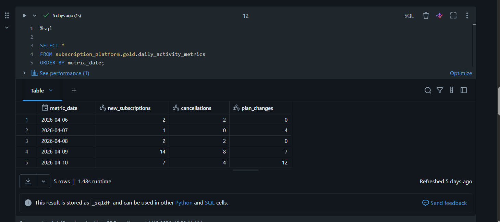

Tracks:

- new subscriptions
- cancellations
- plan changes

### ▸ Subscription KPIs Snapshot

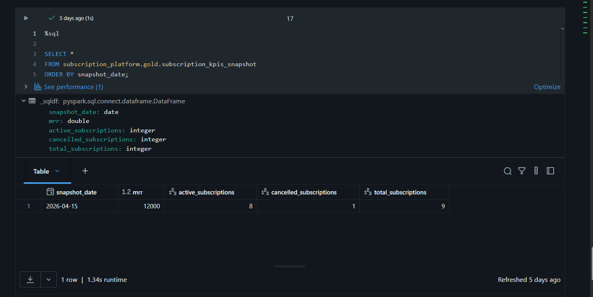

Captures point-in-time metrics:

- MRR (Monthly Recurring Revenue)
- active subscriptions
- cancelled subscriptions
- total subscriptions

## ◼ Analytics Layer (Snowflake)

The analytics layer combines event-based activity data with point-in-time snapshots to produce business KPIs and trends.

Delta UniForm tables are exposed as Iceberg tables and queried in Snowflake.

### 🔵 Business Dashboard (Primary Output)

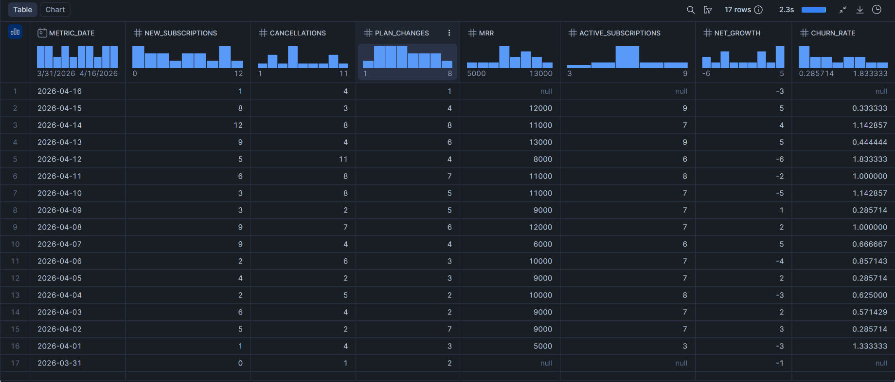

Combines activity and state data to provide:

- MRR
- churn rate
- net growth
- active subscriptions

### 🔵 Churn Analysis

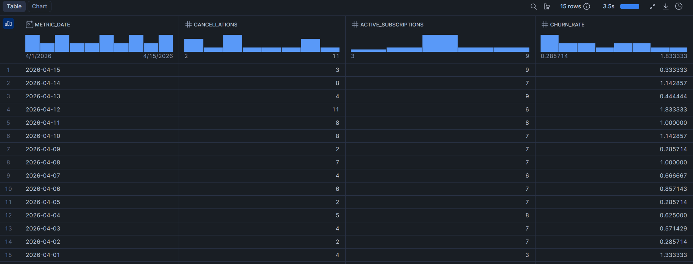

Measures percentage of cancellations relative to active subscriptions.

### 🔵 ARPU Analysis

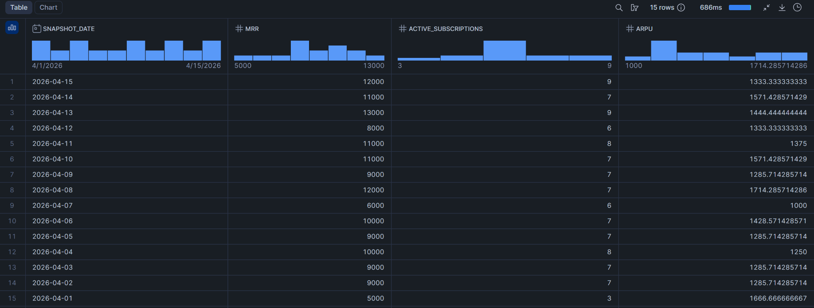

Average revenue per active subscription.

### 🔵 Subscription Growth

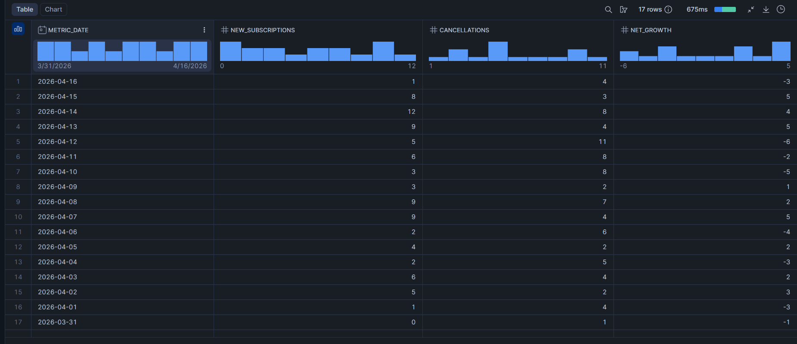

Tracks net growth using new subscriptions and cancellations.

### 🔵 MRR Trend

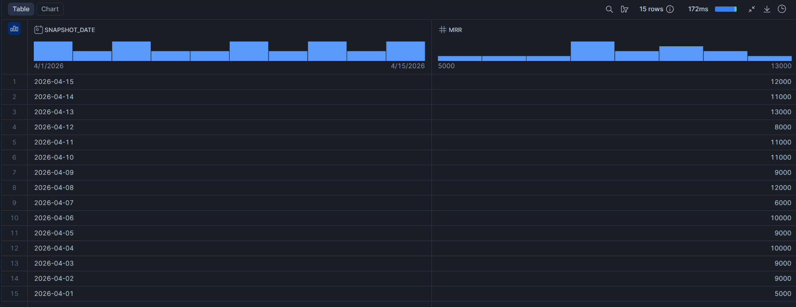

Shows revenue growth over time.

### 🔵 Active Subscriptions Trend

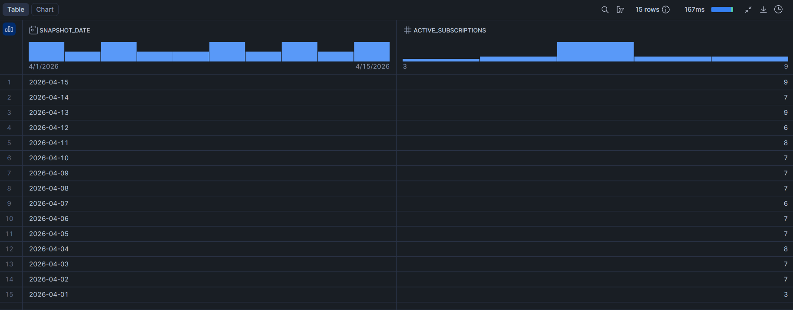

Tracks growth of active users.

### 🔵 MRR Change

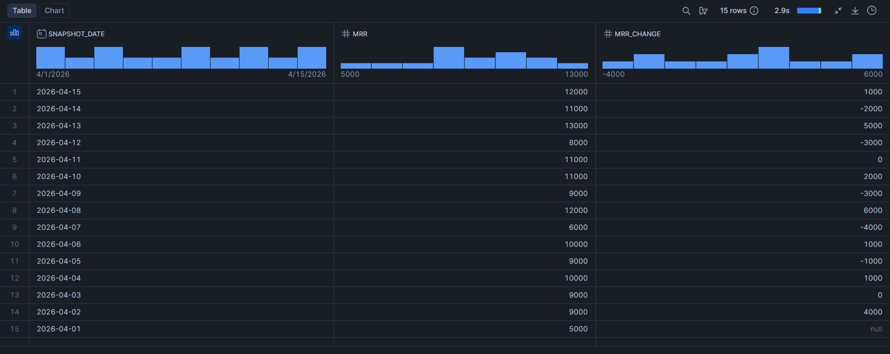

Shows day-over-day revenue changes.

## 🔶 Business Metrics Modeled

- Monthly Recurring Revenue (MRR)
- Churn Rate
- ARPU (Average Revenue Per User)
- Subscription Growth
- Net Growth

## 🔑 Key Concepts Demonstrated

- Event-driven architecture
- Streaming ingestion (Auto Loader)
- Medallion architecture (Bronze, Silver, Gold)
- CDC / SCD Type 2 modeling
- Data lakehouse design (Delta Lake)
- Iceberg compatibility using Delta UniForm
- Separation of processing (Databricks) and analytics (Snowflake)
- Flow vs State modeling for business metrics

## 🟪 How to Run

1. Deploy AWS Lambda for event generation
2. Configure S3 bucket for raw event storage
3. Set up Databricks with Unity Catalog and external location
4. Run Bronze → Silver → Gold notebooks
5. Expose Gold tables as Iceberg (Delta UniForm)
6. Connect Snowflake and create external Iceberg tables
7. Run Snowflake SQL scripts to create analytics views

## 🧩 Project Structure

```
subscription-revenue-data-platform/

├── aws/
│   └── lambda_event_generator.py

├── databricks/
│   ├── bronze/
│   ├── silver/
│   └── gold/

├── snowflake/
│   ├── tables.sql
│   └── views.sql

├── images/
│   ├── architecture/
│   ├── databricks/
│   └── snowflake/

└── README.md
```

## 📍Summary

This project demonstrates how raw event data from a SaaS system can be transformed into meaningful business insights using a modern cloud data stack.

It covers the full flow, from event generation to analytics, while handling real-world challenges like late-arriving data, state modeling, and snapshot-based metrics.
